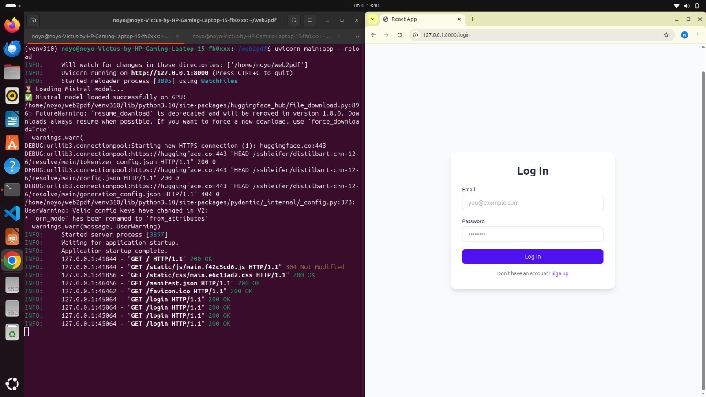
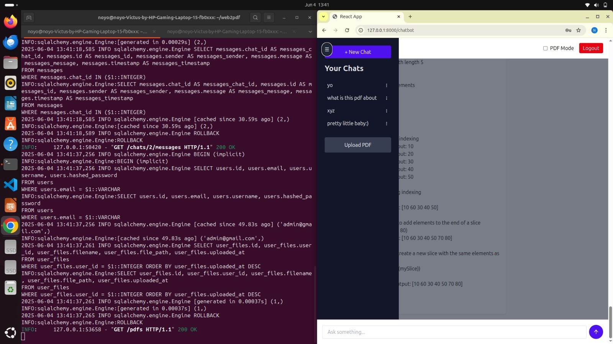
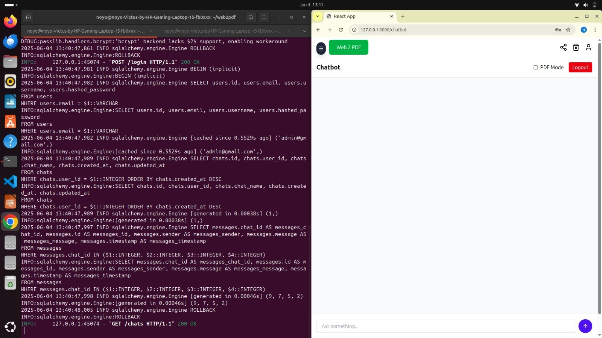
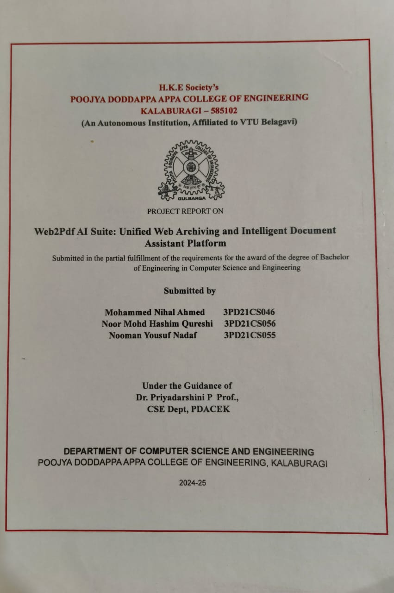
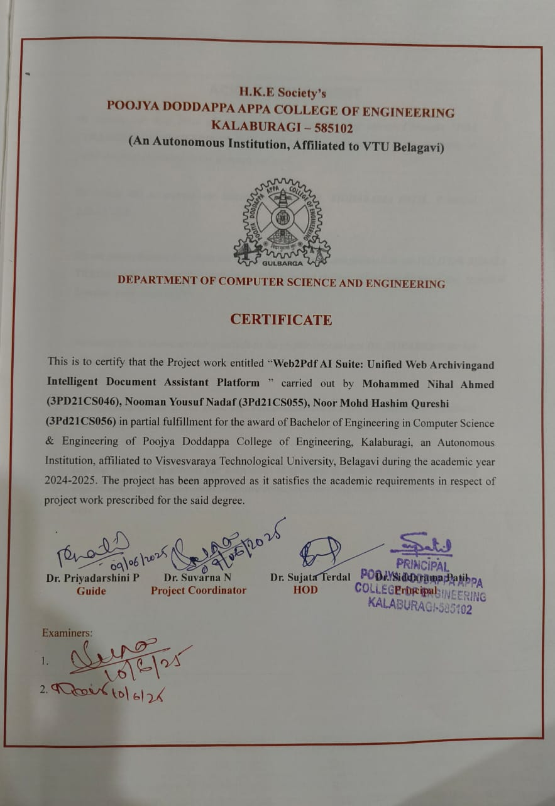

# Web2Pdf AI Suite

> 💡 An intelligent PDF + web-to-PDF + chatbot platform powered by a **local Mistral model (GGUF)** and **ColBERT-based RAG** with FastAPI and React.  
> Built for document understanding, chat context retention, and web crawling to PDF.

---

## 🚀 Project Overview

This project combines:

- **RAG-enabled chatbot** using local **Mistral-7B-Instruct (GGUF)** and **ColBERT retrieval**
- **PDF uploading & querying** with chunk-level relevance
- **Web2PDF** crawler that converts webpage links into downloadable PDF files
- Full-stack implementation using **FastAPI (backend)** and **React (frontend)**

---

## 🧱 Directory Structure

```
web2pdf/
├── api/                    # FastAPI API endpoints
├── configs/                # Configuration constants and paths
├── create_db.py            # DB table initializer
├── huggface_token.txt      # Hugging Face token (ignored in Git)
├── main.py                 # FastAPI app entry point
├── models/                 # Models (GGUF, ColBERT; Git-ignored)
│   ├── ColBERT/
│   ├── colbertv2.0/
│   └── mistral/
├── node_modules/           # Frontend deps (Git-ignored)
├── package.json            # Frontend dependencies
├── package-lock.json
├── schemas/                # Pydantic schemas for API
├── services/               # Core logic: chatbot, PDF processor, ColBERT
├── structure.txt           # Project structure doc
├── venv310/                # Python virtual env (Git-ignored)
├── web2pdf-frontend/       # React frontend
├── webp/                   # Web crawler -> PDF converter
│   ├── main.py
│   ├── static/style.css
│   ├── templates/index.html, status.html
│   └── tmp_pdf_pages/      # Generated PDFs (Git-ignored)
└── README.md
```

---

## 📦 Installation Guide
### Note : Use Chatgpt for setup -:)
### 🔹 1. Clone the Repo

```bash
git clone https://github.com/your-username/web2pdf-ai-suite.git
cd web2pdf-ai-suite
```

---

### 🔹 2. Backend Setup (Python 3.10+)

```bash
python3 -m venv venv310
source venv310/bin/activate
pip install --upgrade pip
pip install -r requirements.txt
```

---

### 🔹 3. Frontend Setup (React)

```bash
cd web2pdf-frontend
npm install
```

To run the frontend:

```bash
npm run dev
```

> ⚠️ `node_modules/` is ignored in Git. Do not commit it.

---

## 🔍 Local Model & Retrieval Setup

### 1. Download Mistral GGUF Model

We use the **Mistral 7B Instruct v0.1 Q4_K_M GGUF** model.

Download from Hugging Face:  
👉 https://huggingface.co/TheBloke/Mistral-7B-Instruct-v0.1-GGUF

**Save to:**

```
web2pdf/models/mistral/mistral-7b-instruct-v0.1.Q4_K_M.gguf
```

---

### 2. Hugging Face Token (for summarization)

Create a file:

```
huggface_token.txt
```

Add your HF token inside.  
⚠️ This file is already **.gitignored**.

---

### 3. ColBERT Setup (Semantic Retriever)

```bash
cd web2pdf/models
git clone https://github.com/stanford-futuredata/ColBERT.git
cd ColBERT
pip install -r requirements.txt
python -m nltk.downloader punkt
```

ColBERT is used to **index and search PDF chunks** for better context.

---

## 🧠 Chatbot Usage

1. Sign up or log in from `/login`.
2. Upload PDF from the sidebar.
3. Toggle **PDF Mode** to enable document Q&A.
4. Select uploaded PDF and start chatting.
5. The model uses ColBERT + Mistral to reply using chunked context.

---

## 🌐 Web to PDF Tool

Run the crawler:

```bash
cd webp/
python main.py
```

- Accepts a website URL.
- Crawls all anchor links.
- Converts them into a single, link-rich PDF.
- Saves to `/webp/tmp_pdf_pages/`

---

## 🔐 Authentication

- JWT-based authentication
- Stored in `localStorage`
- Automatically added to requests in frontend

---

## 🛠️ DB Initialization

Create DB tables using:

```bash
python create_db.py
```

---

## ✅ Features Completed

- ✅ Mistral-based local chatbot (GGUF)
- ✅ RAG with ColBERT indexing
- ✅ Summarization using HF transformer
- ✅ PDF upload, processing, querying
- ✅ Web-to-PDF crawler (Flask)
- ✅ User auth (JWT)
- ✅ React frontend (chat, PDF upload, dropdown, sidebar, logout, etc.)
- ✅ Chat history + chat rename/delete per user

---

## 📜 Screenshots
### Login Page


### Sidebar


### Chat Interface


### Journal 


### Acknowledgement certificate


---

## 👨‍💻 Author

**Nooman Yousuf**,**Mohd hashim qureshi**,**Mohammed Nihal Ahmed** 
📧 nooman144yousuf@gmail.com  
🔗 [GitHub](https://github.com/nooman57554)
